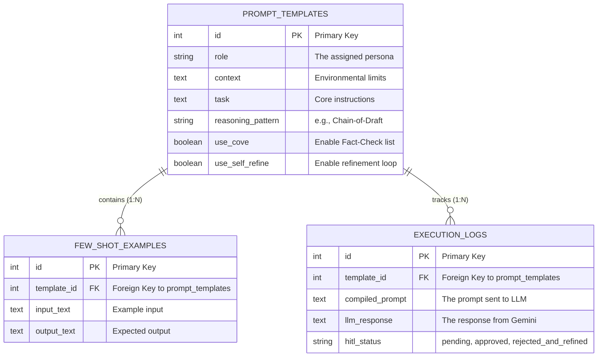
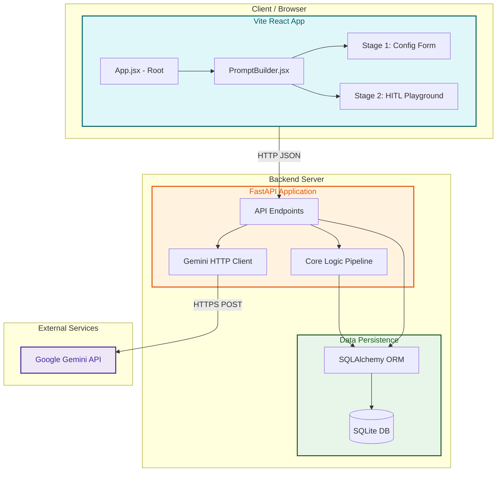

# Prompt Builder Assistant Architecture

Here are the visual representations of the database schema and the application's core logic flow, generated using Mermaid diagrams.

## Database Entity-Relationship Diagram

This diagram maps out the SQLite database constructed using SQLAlchemy. It highlights the primary table `prompt_templates` and its one-to-many relationships with `few_shot_examples` and `execution_logs`.

## High-Level Project Architecture

This structural flowchart maps out the physical and logical components of the web application, showing how the frontend, backend, database, and external APIs are organized.

